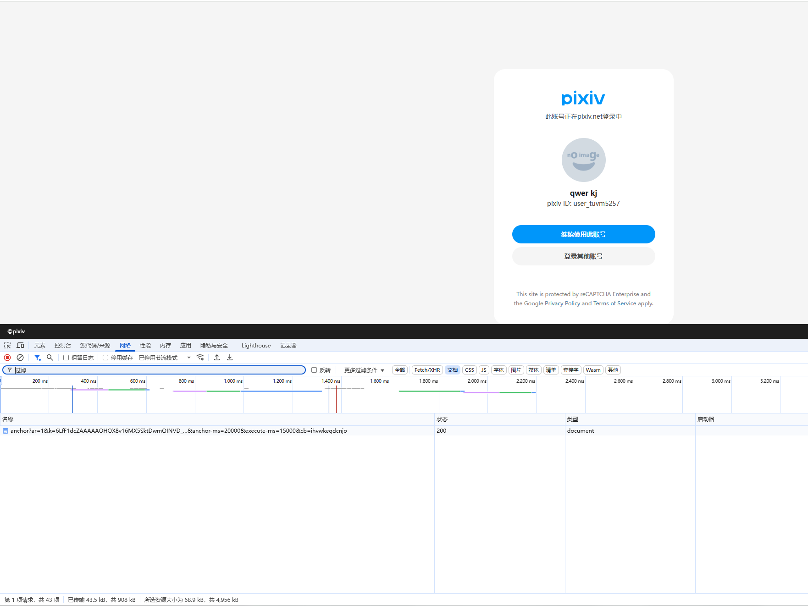
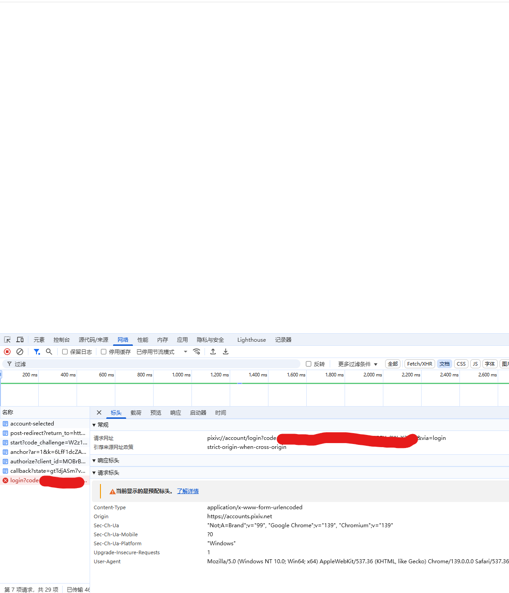
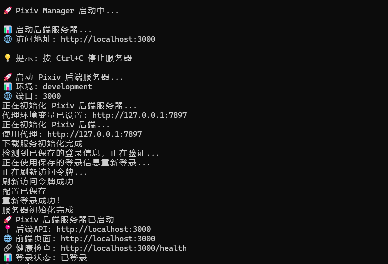
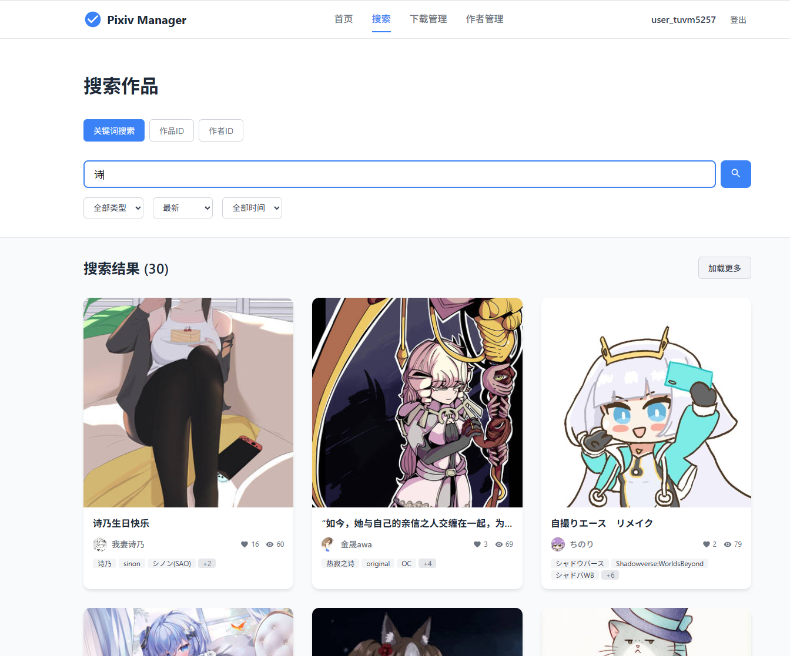
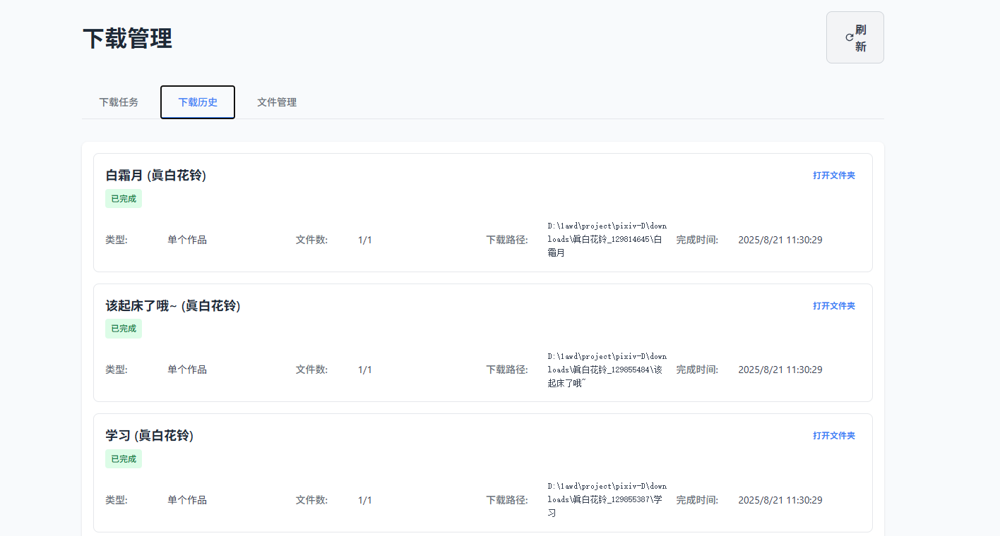
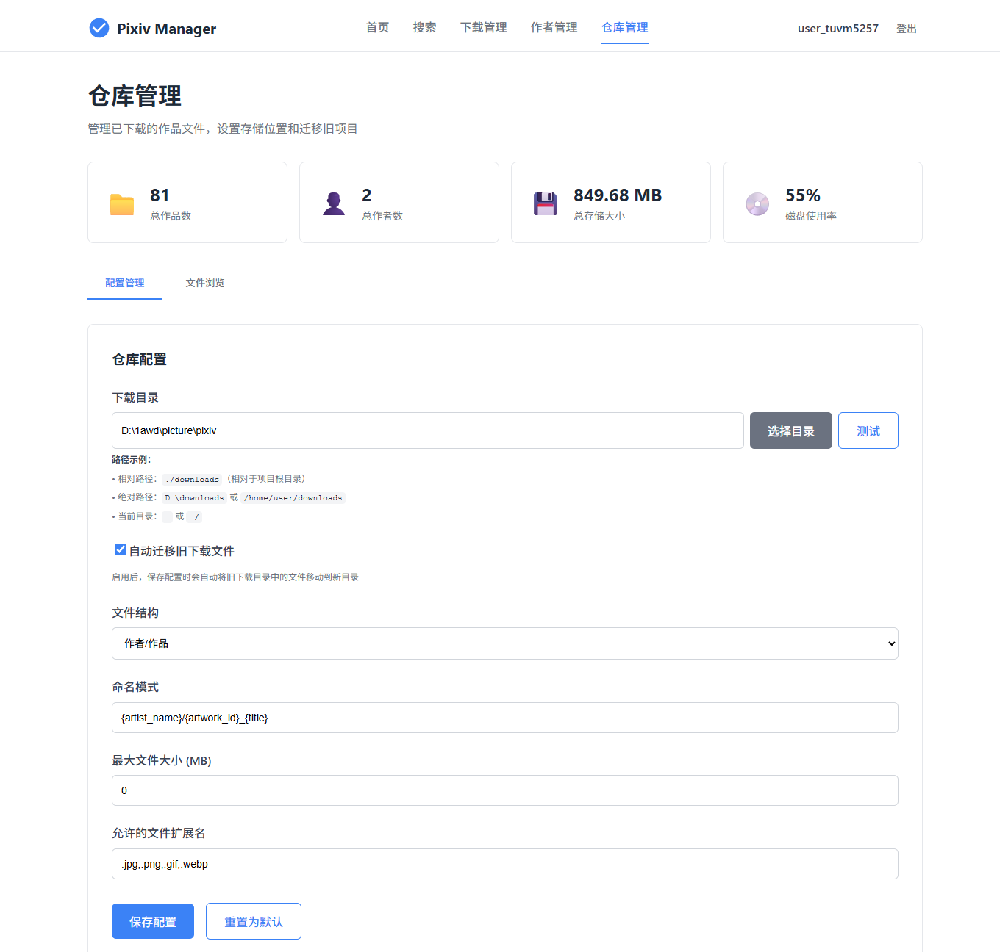
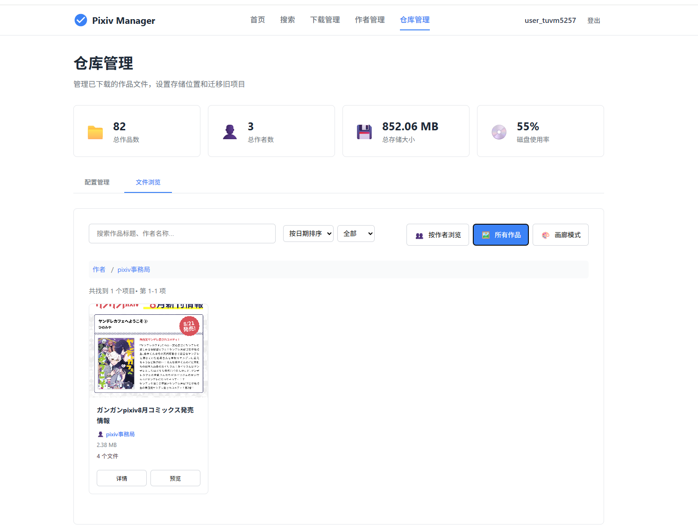

# Pixiv 下载浏览管理器

一个简单易用的 Pixiv 作品下载和浏览管理工具，最近闲着没事逛逛p站，发现p站下载一个个手点累的很，看看现成的项目都比较久远或者是操作麻烦，干脆自己搞一个玩玩。

## 📋 项目介绍

Pixiv 下载浏览管理器是一个基于 Web 的应用程序，提供以下功能：

- 🔍 作品搜索和浏览
- 📥 作品下载管理与同步
- 📁 本地仓库管理
- 🖼️ 画廊模式浏览

## 视频演示

观看登录教学演示：

<p align="center">
  <video src="https://github.com/user-attachments/assets/0b7ee0fd-6af2-4d5f-8db1-c204b5b38eb3" width="800" controls>
    Your browser does not support the video tag.
  </video>
</p>

观看更新内容发布页（关注于新功能演示，上面的视频主要是登录教学）：

[](https://sywb.top/Staticfiles/updates.html)

## 🚀 快速开始

### 便携版下载（如果不想自义定或者是懒）

如果懒得配置环境，可以直接下载便携版（日，我自己用怎么还被当成木马了，算了忽略一下，不放心就自己打包（npm bp运行一下即可））：

**方式一：直接下载（可能比较慢，服务器带宽有限辣）**
- **下载链接**: [点我下载](https://sywb.top/Staticfiles/p%E4%B8%8B%E8%BD%BD%E5%99%A8.rar)

**方式二：发行版下载**
- **发行版**  : [点我跳转](https://github.com/kjqwer/pixiv-D/releases)

**使用说明**: 下载后解压，如需修改配置可编辑 `config.json` 文件（通常自动检测代理即可），双击 `pixiv-manager.exe` 即可启动，打开网站，按照教程登录即可

### 环境要求

- **Node.js** (版本 >= 16.0.0)
- **npm** 或 **pnpm** (推荐使用 pnpm)

### 安装步骤

1. **安装 Node.js**
   - 访问 [Node.js 官网](https://nodejs.org/) 下载并安装

2. **获取并解压前端文件**
   - 从[发行版](https://github.com/kjqwer/pixiv-D/releases)获取dist.zip，（或者自己在ui目录下载依赖build一下）
   - 进入 `ui` 目录
   - 解压 `dist.zip` 文件到 `ui/dist` 目录

3. **安装依赖**
   ```bash
   # 在项目根目录执行
   npm install
   # 或者使用 pnpm (推荐)
   pnpm install
   ```

4. **启动应用**
   ```bash
   # 在项目根目录执行
   pnpm dev 或者 node backend/start.js
   ```

5. **访问应用**
   - 打开浏览器访问：http://localhost:3001 （默认端口，可在 config.json 中修改）

## 🌐 代理配置

应用现在支持自动检测系统代理，通常情况下无需手动配置。如果你使用 Clash、V2Ray 等代理软件并已设置为系统代理，应用会自动使用。

### 自动代理检测（推荐）
- 应用会自动检测系统环境变量中的代理设置
- 支持 HTTP_PROXY、HTTPS_PROXY 等标准环境变量
- 无需手动配置，开箱即用

### 手动配置（可选）
如果自动检测不工作，可以手动配置：

1. **修改配置文件**：
   - 编辑项目根目录下的 `config.json` 文件
   - 设置 `proxy.enabled` 为具体端口号（如 7890）
   - 设置 `proxy.port` 为对应端口

2. **常见代理端口**：
   - Clash: 7890
   - V2Ray: 10809  
   - Shadowsocks: 1080
   - 其他代理软件请查看其设置页面获取端口号

**配置示例**：
```json
{
  "proxy": {
    "port": 7890,
    "enabled": true
  }
}
```

## 🔐 登录认证

### 获取授权码（链接过期比较快，记得操作快一点）

1. **访问 Pixiv 开发者页面（ui登录页面点击自动跳转）**
   

2. **创建应用并获取授权码**
   

3. **在应用中输入授权码完成登录（登录一次下次就不用登了）**

## 📱 功能展示

### 脚本启动


### 搜索功能
- **作品搜索（下载过的会有提示）**
  

- **作者搜索**
  

- **作品ID搜索**
  

### 列表轮换
- **通过作者搜索进入作品可以上下一个切换，注意只有当页的30个，到末尾需要翻页再进入**
- 
  
### 下载管理


### 仓库管理


### 作品检索


### 画廊模式


## 🛠️ 开发说明

本项目刚刚建立，很多功能还不够完善，欢迎大家一起参与开发！

### 技术栈
- **后端**: Node.js + Express
- **前端**: Vue3 + Vite
- **包管理**: pnpm (推荐)

### 项目结构
```
你的项目文件/
├── backend/          # 后端服务
├── ui/              # 前端应用
│   ├── dist/        # 打包后的前端文件
│   └── src/         # 前端源码
├── downloads/       # 下载目录
├── data/           # 数据存储
├── config.json     # 配置文件
└── config.json.example  # 配置文件示例
```

## 🤝 贡献

欢迎提交 Issue 和 Pull Request 来帮助改进这个项目！

## 许可证

MIT License