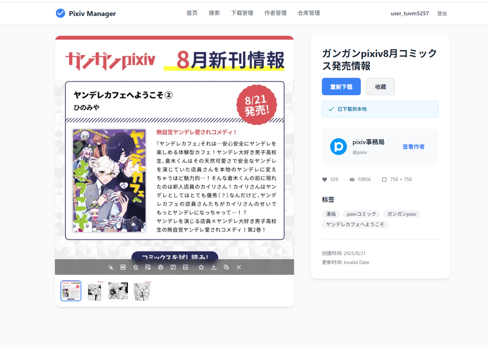

# Pixiv 下载浏览管理器

一个简单易用的 Pixiv 作品下载和浏览管理工具，最近闲着没事逛逛p站，发现p站下载一个个手点累的很，看看现成的项目都比较久远或者是操作麻烦，干脆自己搞一个玩玩。

## 📋 项目介绍

Pixiv 下载浏览管理器是一个基于 Web 的应用程序，提供以下功能：

- 🔍 作品搜索和浏览
- 📥 作品下载管理
- 👤 作者搜索
- 🆔 作品ID搜索
- 📁 本地仓库管理
- 🖼️ 画廊模式浏览
- 🔍 作品检索和分类

## 视频演示

观看完整教学演示（视频使用的是便携包）：

[](https://sywb.top/Staticfiles/p%E6%95%99%E7%A8%8B.mp4)

观看更新内容（关注于新功能演示，上面的视频主要是登录教学）：

[](https://sywb.top/Staticfiles/p%E6%9B%B4%E6%96%B0.mp4)

## 🚀 快速开始

### 便携版下载（如果不想自义定或者是懒）

如果懒得配置环境，可以直接下载便携版（日，我自己用怎么还被当成木马了，算了忽略一下，不放心就自己打包）：

**方式一：百度网盘下载（更新不勤，版本可能比较落后）**
- **下载链接**: https://pan.baidu.com/s/1YAHkfXSDX6GxoxE89uspYg?pwd=ejbs
- **提取码**: ejbs

**方式二：直接下载（可能比较慢，服务器带宽有限辣）**
- **下载链接**: https://sywb.top/Staticfiles/p%E4%B8%8B%E8%BD%BD%E5%99%A8.rar

**使用说明**: 下载后解压，记事本打开start.bat配置代理（看readme有介绍），双击 `start.bat` 即可启动，打开网站，按照教程登录即可

### 环境要求

- **Node.js** (版本 >= 16.0.0)
- **npm** 或 **pnpm** (推荐使用 pnpm)

### 安装步骤

1. **安装 Node.js**
   - 访问 [Node.js 官网](https://nodejs.org/) 下载并安装

2. **解压前端文件**
   - 进入 `ui` 目录
   - 解压 `dist.zip` 文件到 `ui/dist` 目录

3. **安装依赖**
   ```bash
   # 在项目根目录执行
   npm install
   # 或者使用 pnpm (推荐)
   pnpm install
   ```

4. **启动应用**
   - 修改代理端口，请用记事本打开 `start.bat` 文件，修改PROXY_PORT端口号
   - 双击 `start.bat` 文件启动

5. **访问应用**
   - 打开浏览器访问：http://localhost:3000

## 🌐 代理配置

当然既然能上P站，怎么上网就不多说了，代理别忘了配置，可以去软件里看（一定要改）：

**修改代理端口**：
1. 用记事本打开 `start.bat` 文件
2. 找到：`set PROXY_PORT=xxxx`
3. 将 `xxxx` 改为你的代理端口号

**常见代理端口**：
- Clash: 7890
- V2Ray: 10809  
- Shadowsocks: 1080
- 其他代理软件请查看其设置页面获取端口号

## 🔐 登录认证

### 获取授权码（链接过期比较快，记得操作快一点）

1. **访问 Pixiv 开发者页面（ui登录页面点击自动跳转）**
   

2. **创建应用并获取授权码**
   

3. **在应用中输入授权码完成登录（登录一次下次就不用登了）**

## 📱 功能展示

### 脚本启动


### 搜索功能
- **作品搜索（下载过的会有提示）**
  

- **作者搜索**
  

- **作品ID搜索**
  

### 列表轮换
- **通过作者搜索进入作品可以上下一个切换，注意只有当页的30个，到末尾需要翻页再进入**
- 
  
### 下载管理


### 仓库管理


### 作品检索


### 画廊模式


## 🛠️ 开发说明

本项目刚刚建立，很多功能还不够完善，欢迎大家一起参与开发！

### 技术栈
- **后端**: Node.js + Express
- **前端**: Vue3 + Vite
- **包管理**: pnpm (推荐)

### 项目结构
```
你的项目文件/
├── backend/          # 后端服务
├── ui/              # 前端应用
│   ├── dist/        # 打包后的前端文件
│   └── src/         # 前端源码
├── downloads/       # 下载目录
├── data/           # 数据存储
└── start.bat       # 启动脚本
```

## 🤝 贡献

欢迎提交 Issue 和 Pull Request 来帮助改进这个项目！

## 许可证

MIT License 